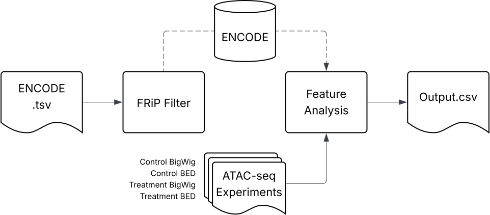

# manuscript

## Table of Contents

- [Installation](#installation)
- [Pipeline](#pipeline)
- [Usage](#usage)
- [Configuration](#configuration)
- [Examples](#examples)
- [License](#license)

## Installation

### To install, clone this repository:
```bash
git clone https://github.com/alankang25/manuscript.git
cd manuscript
```

### This pipeline uses a conda environment to manage dependencies. To install with Conda:
```bash
# 1. Create environment (first time only)
conda env create -f environment.yml

# 2. Activate new environment
conda activate manuscript-pipeline
```
### Now you are ready to run the pipeline

## Pipeline
### Below is an outline of the pipeline which takes in an ENCODE formatted TSV file, ATAC-seq BigWig and peak files pre- and post- treatment to list the importance of various chromatin features in explaining accessibility changes across treatment groups. This output is organized in a .csv file named output.csv. In this example, data from BRG1/BRM Associated Factors Complex (BAF) inhibited GM12878 cells will be used.



## Usage
### FRiP Filtering

### Machine Learning Feature Analysis

## Congiguration
### add function where different ML parameters are tweaked from the command line