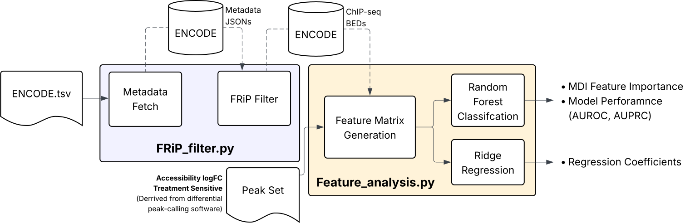

# manuscript

## Table of Contents

- [Installation](#installation)
- [Pipeline](#pipeline)
- [Usage](#usage)
- [Configuration](#configuration)
- [Outputs](#outputs)

## Installation

### To install, clone this repository:
```bash
# 1. Clone the github repo
git clone https://github.com/alankang25/manuscript.git

# 2. Set current directory to script
cd manuscript
```

### This pipeline uses a conda environment to manage dependencies. To install with Conda:
```bash
# 1. Create environment (first time only)
conda env create -f environment.yml

# 2. Activate new environment
conda activate manuscript-pipeline
```

## Pipeline
### Below is an outline of the pipeline which takes in an ENCODE formatted TSV file, ATAC-seq BigWig and peak files pre- and post- treatment to list the importance of various chromatin features in explaining accessibility changes across treatment groups. This output is organized in a .csv file named output.csv. In this example, data from BRG1/BRM Associated Factors Complex (BAF) inhibited GM12878 cells will be used.



## Usage

### FRiP and Peak Count Filtering

```bash
# For this demo, a tsv with the following filters from ENCODE was downloaded:
# biosample=GM12878, Output Type=IDR thresholded peaks, File format=bed, Assay Title=TF ChIP-seq, Status=Released

python script/FRiP_filter.py -i "INPUT_ENCODE_TSV" -t "CHIP-SEQ_TYPE"
```

### To reset the ENCODE BED download directory
```bash
python script/Reset_bed.py 
```

### Random Forest and Linear Regression Feature Analysis
```bash
python script/Feature_analysis.py -c "PATH_TO_CONTROL_FILES" -t "PATH_TO_TREATMENT_FILES"
```

## Configuration
### If needed, here are some configurations available for the FRiP_filter script.
```bash
# While filtering for the highest FRiP value in a target, you can also set a minimum peak number cutoff. For example: 

python script/FRiP_filter.py -i "INPUT_ENCODE_TSV" -t "CHIP-SEQ_TYPE" -m 1000 

# will remove all BED files with less than 1000 peaks total. This way, you can filter out files that have low signal.

#TODO: add more functionality to script
```

### For the Feature_analysis script, here are the following configs:
```bash
# Wile generating the feature matrix, you can choose to exclude samples that overlap with certain features. For example: 

python script/Feature_analysis.py -d "PATH_TO_DIFFERENTIAL_PEAK_CALLING_TSV" -x CTCF

# will remove any regions that are CTCF bound from the feature matrix

```

## Outputs 
### The following diagram shows the directory paths of generated plots & files: 


```bash

# Under manuscript, two subdirectories (scripts and data) exist:

manuscript/
├── scripts/
│   └── # python scripts FRiP_filter.py, Feature_analysis.py, and Reset_bed.py. These files should not be altered.
└── data/
    └── # input and output data files


# Under data, three subdrectories (metadata, input, and output) exist

data/
├── metadata/
│   └── # ENCODE metadata and configuration files
├── input/
│   └── # raw input files such as BigWig, BED, and TSV files
└── output/
    └── # processed results, plots, and output.csv

# Execution of Reset_bed.py clears all metadata JSON files and ChIP-seq bed files under metadata and input subdirectories. This is to ensure that both histone ChIP-seq and TF ChIP-seq BED files can be processed even with different data tracking schemes and naming conventions.

```